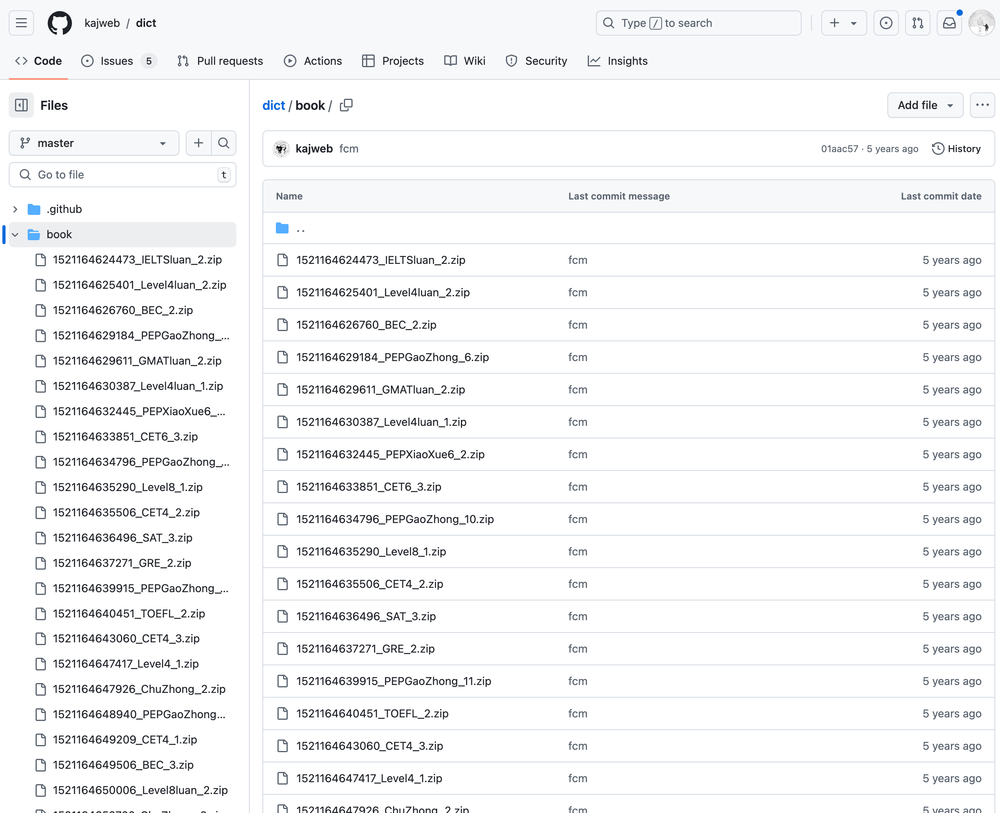

# 0003. qwerty-learner 英文单词数据源

- 📝 summary
  - 记录了【qwerty-learner 英文单词数据源】的完整 JSON 数据的获取方式。

## 🔗 links

- https://github.com/kajweb/dict
  - github dict
  - 从这里边获取所有词典数据。
  - 

```bash
# 一共有以下这些 json 文件
.
├── BEC_2.json
├── BEC_3.json
├── BeiShiGaoZhong_1.json
├── BeiShiGaoZhong_10.json
├── BeiShiGaoZhong_11.json
├── BeiShiGaoZhong_2.json
├── BeiShiGaoZhong_3.json
├── BeiShiGaoZhong_4.json
├── BeiShiGaoZhong_5.json
├── BeiShiGaoZhong_6.json
├── BeiShiGaoZhong_7.json
├── BeiShiGaoZhong_8.json
├── BeiShiGaoZhong_9.json
├── CET4_1.json
├── CET4_2.json
├── CET4_3.json
├── CET4luan_1.json
├── CET4luan_2.json
├── CET6_1.json
├── CET6_2.json
├── CET6_3.json
├── CET6luan_1.json
├── ChuZhong_2.json
├── ChuZhong_3.json
├── ChuZhongluan_2.json
├── GMAT_2.json
├── GMAT_3.json
├── GMATluan_2.json
├── GRE_2.json
├── GRE_3.json
├── GaoZhong_2.json
├── GaoZhong_3.json
├── GaoZhongluan_2.json
├── IELTS_2.json
├── IELTS_3.json
├── IELTSluan_2.json
├── KaoYan_1.json
├── KaoYan_2.json
├── KaoYan_3.json
├── KaoYanluan_1.json
├── Level4_1.json
├── Level4_2.json
├── Level4luan_1.json
├── Level4luan_2.json
├── Level8_1.json
├── Level8_2.json
├── Level8luan_2.json
├── PEPChuZhong7_1.json
├── PEPChuZhong7_2.json
├── PEPChuZhong8_1.json
├── PEPChuZhong8_2.json
├── PEPChuZhong9_1.json
├── PEPGaoZhong_1.json
├── PEPGaoZhong_10.json
├── PEPGaoZhong_11.json
├── PEPGaoZhong_2.json
├── PEPGaoZhong_3.json
├── PEPGaoZhong_4.json
├── PEPGaoZhong_5.json
├── PEPGaoZhong_6.json
├── PEPGaoZhong_7.json
├── PEPGaoZhong_8.json
├── PEPGaoZhong_9.json
├── PEPXiaoXue3_1.json
├── PEPXiaoXue3_2.json
├── PEPXiaoXue4_1.json
├── PEPXiaoXue4_2.json
├── PEPXiaoXue5_1.json
├── PEPXiaoXue5_2.json
├── PEPXiaoXue6_1.json
├── PEPXiaoXue6_2.json
├── SAT_2.json
├── SAT_3.json
├── TOEFL_2.json
├── TOEFL_3.json
├── WaiYanSheChuZhong_1.json
├── WaiYanSheChuZhong_2.json
├── WaiYanSheChuZhong_3.json
├── WaiYanSheChuZhong_4.json
├── WaiYanSheChuZhong_5.json
└── WaiYanSheChuZhong_6.json
```
