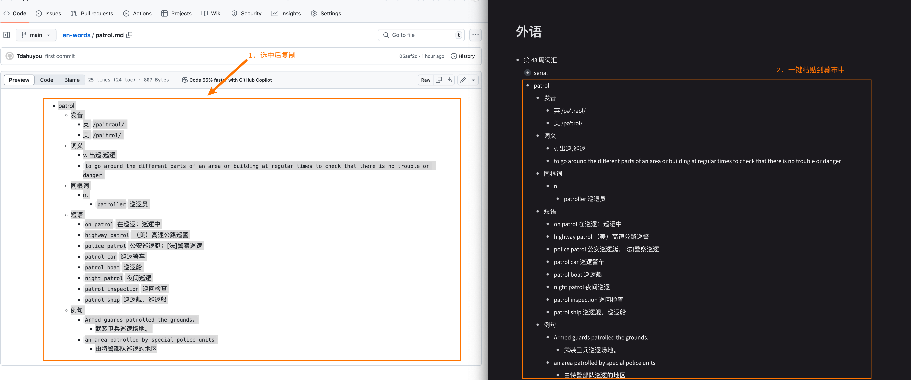
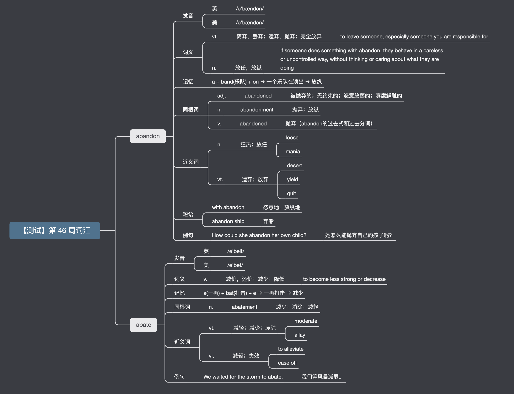

# [0005. en-words 结合幕布一起使用](https://github.com/Tdahuyou/en-notes/tree/main/0005.%20en-words%20%E7%BB%93%E5%90%88%E5%B9%95%E5%B8%83%E4%B8%80%E8%B5%B7%E4%BD%BF%E7%94%A8)

<!-- region:toc -->
<!-- endregion:toc -->
## 1. 📝 Summary
- 记录了个人的英语单词词库 en-words 是如何与幕布一起使用的。

## 2. 🔗 notes

- https://mubu.com

## 3. 📒 notes - 使用流程

- 比如在某一周（比如 24 年的第 43 周 10.21～10.27）需要学习单词 serial、patrol 等，那么只需要在幕布中新建一个节点，比如“第 43 周”，然后在 en-words 中搜索单词，然后复制单词文本，一键粘贴到幕布中即可。
  - 

## 4. 📒 notes - 使用流程【2024 年 11 月 9 日 20:26:05 补充说明】

- 在 `2024 年 11 月 9 日 20:26:05` 修改了 0001 中的脚本，对生成的词典数据结构做了一些调整，让每一个节点存放的信息更明确一些，比如：
  - 单词的音标原先是一起写在一个节点中的，现在拆分为了两个独立的节点。
  - 单词词性和词意，原来是放在一个节点中的，现在拆分为了单独的节点。
  - ……
  - 目的：为了让复制的内容被丢到幕布中查看时，结构更清晰，切换为思维导图的时候预览的效果更好一些。
  - 示例：以 abandon、adate 这俩单词为例，将内容复制到幕布中后的效果如下图所示：
  - 

**示例单词 abandon**

```
- abandon
  - 发音
    - 英
      - `/ə'bændən/`
    - 美
      - `/ə'bændən/`
  - 词义
    - vt.
      - 离弃，丢弃；遗弃，抛弃；完全放弃
        - `to leave someone, especially someone you are responsible for`
    - n.
      - 放任，放纵
        - `if someone does something with abandon, they behave in a careless or uncontrolled way, without thinking or caring about what they are doing`
  - 记忆
    - a + band(乐队) + on → 一个乐队在演出 → 放纵
  - 同根词
    - adj.
      - `abandoned`
        - 被抛弃的；无约束的；恣意放荡的；寡廉鲜耻的
    - n.
      - `abandonment`
        - 抛弃；放纵
    - v.
      - `abandoned`
        - 抛弃（abandon的过去式和过去分词）
  - 近义词
    - n.
      - 狂热；放任
        - `loose`
        - `mania`
    - vt.
      - 遗弃；放弃
        - `desert`
        - `yield`
        - `quit`
  - 短语
    - `with abandon`
      - 恣意地，放纵地
    - `abandon ship`
      - 弃船
  - 例句
    - `How could she abandon her own child?`
      - 她怎么能抛弃自己的孩子呢？
```

**示例单词 abate**

```
- abate
  - 发音
    - 英
      - `/ə'beit/`
    - 美
      - `/ə'bet/`
  - 词义
    - v.
      - 减价，还价；减少；降低
        - `to become less strong or decrease`
  - 记忆
    - a(一再) + bat(打击) + e → 一再打击 → 减少
  - 同根词
    - n.
      - `abatement`
        - 减少；消除；减轻
  - 近义词
    - vt.
      - 减轻；减少；废除
        - `moderate`
        - `allay`
    - vi.
      - 减轻；失效
        - `to alleviate`
        - `ease off`
  - 例句
    - `We waited for the storm to abate.`
      - 我们等风暴减弱。
```